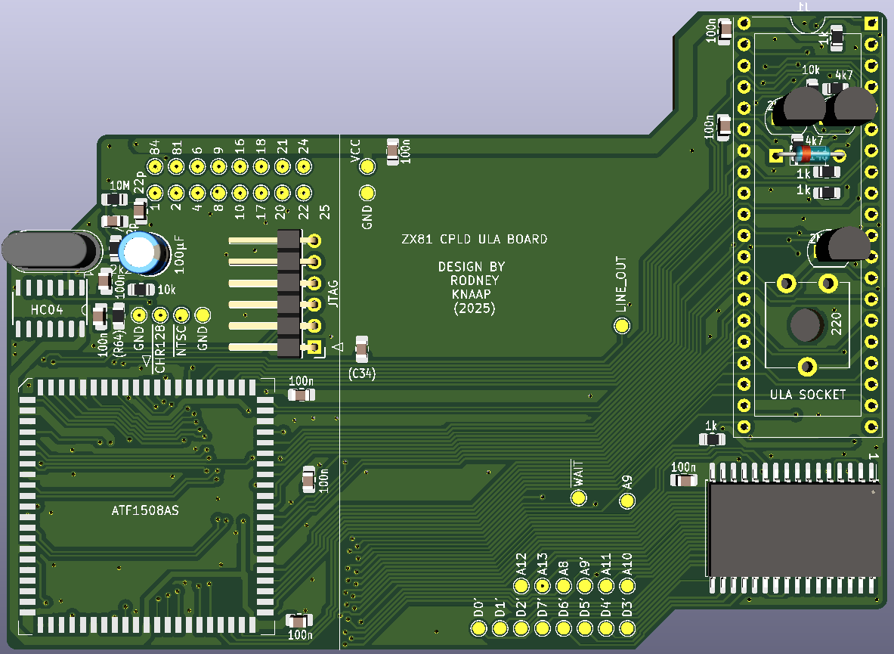
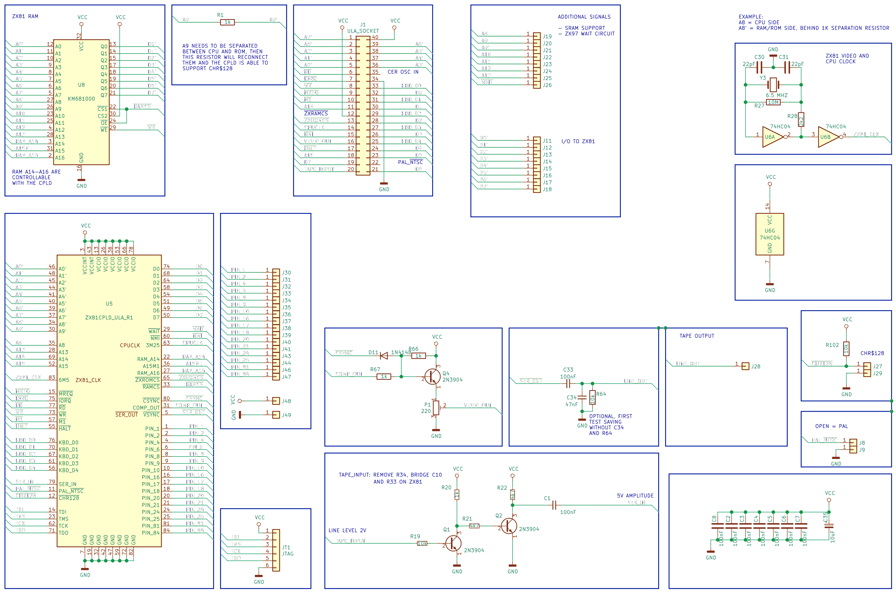

## Purpose and permitted use, cautions for a potential builder of this design
This project was created for historical purposes out of love for historical computing designs and for the purpose of enabling computing enthousiasts with a sufficient level of building and troubleshooting expertise to be able to experience the technology by building and troubleshooting the hardware described in this project.

Besides the GPL3 license there are a few warnings and usage restrictions applicable:
No guarantees of function or fitness for any particular or useful purpose is given, building and using this design is at the sole responsibility of the builder.

Do not attempt this project unless you have the necessary electronics assembly expertise and experience, and know how to observe all electronics safety guidelines which are applicable.

It is not permitted to use the computer built from this design without the assumption of the possibility of loss of data or malfunction of the connected device. To be used strictly for personal hobby and experimental purposes only. No applications are permitted where failure of the device could result in damage or injury of any kind.

If you plan to use this design or any part of it in new designs, the acknowledgement of the designer and the design sources and inspirations, historical and modern, of all subparts contained within this design should be included and respected in your publication, to accredit the hard work, time and effort dedicated by the people before you who contributed to make your project possible.

No guarantee for any proper operation or suitability for any possible use or purpose is given, using the resulting hardware from this design is purely educational and experimental and not intended for serious applications. Loss of data is likely and to be expected when connecting any storage device or storage media to the resulting system from this design, or when configuring or operating any storage device or media with the system of this design.

When connecting this system to a computer network which contains stored information on it, it is at the sole responsibility and risk of the person making the connection, no guarantee is given against data loss or data corruption, malfunctions or failure of the whole computer network and/or any information contained inside it on other devices and media which are connected to the same network.

When building this project, the builder assumes personal responsibility for troubleshooting it and using the necessary care and expertise to make it function properly as defined by the design. You can email me with questions, but I will reply only if I have time and if I find the question to be valid. Which will probably also lead to an update here. I want to primarily dedicate my time to new project development, I am not able to do any user support, so that's why I provide the elaborate info here which will be expanded if needed.

# Acknowledgements

This project was inspired by:
- Sinclair computers in the 1980s
- Wilf Rigter who helped me with my PCB designs in the 1990s
- the German ZX-Team who inspired me a lot by sending me their Magazin and kind letters and messages. Particularly Peter Liebert Adelt and Kai Fischer with whom I have had very pleasant and memorable contact in the 1990s years.

  

# Concept of the project
# ZX81_ULA_ISSUE_5

This project has been designed as a replacement solution for the Sinclair ZX81 ULA.
It uses a small PCB which is plugged into the ULA socket, and requires some manual wiring of some ZX81 signals and a few modifications to the ZX81 to support full operation as designed.

The main reasons for using additional connections are:
- addition of 128KB SRAM which by default is available as 56KB
- bank switching RAM could be created which allows access to the full SRAM capacity however beware of limitations in numbers of registers supported in the CPLD
- bank switching granularity would 16KB per page, CPLD outputs A14-A16 to the SRAM
- addition of line level tape loading input for using a phone or PC audio output to load programs into the ZX81
- addition of a composite video driver transistor circuit using a potmeter to adjust composite voltage
- CHR$128 support is possible, UDG is supported using the SRAM on the ULA PCB

The CPLD used has some spare pins available which are routed to solderable pads, which could support some experimentation for creating additional expansions. 

The CPLD could assist expansion in a number of ways, for example providing I/O decoding outputs, and wiring only the I/O device to the expansion port, or if the expansion circuit needed is smaller it could possibly be directly driven by the CPLD as well.

All the logic in the CPLD is reconfigurable which allows more experimentation on the ZX81 as well.  

Schematic of the PCB:

This schematic and the schematic of the quartus project are available in PDF. 

The details of how to make the connections and modifications will be described shortly here in this text.

Please only attempt this project if you feel capable of constructing this PCB, properly connecting it inside a ZX81 and debugging the operation independently.
Some creative construction would be useful to integrate this solution in a reliable way inside the ZX81.

Further updates will follow.

Kind regards,

Rodney

